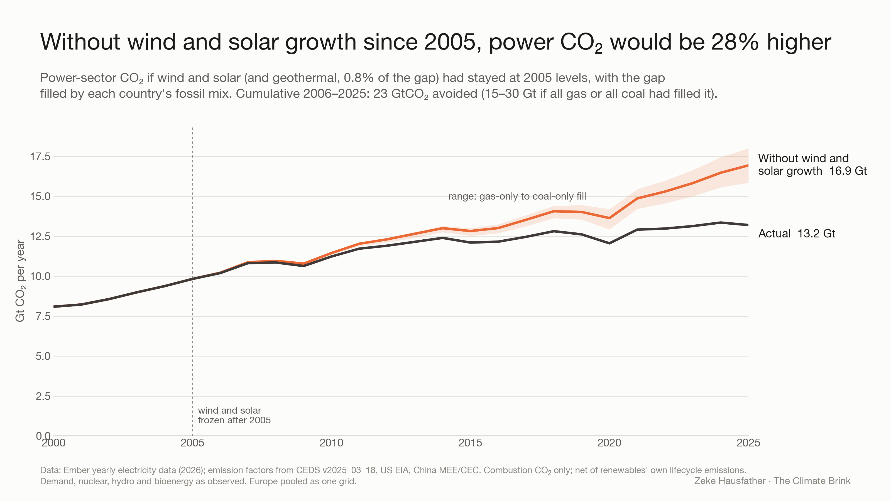
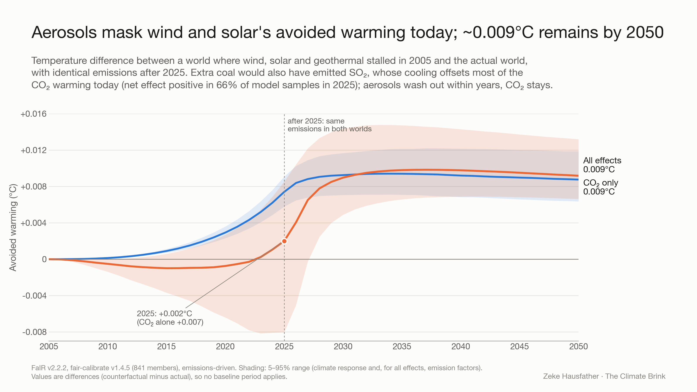
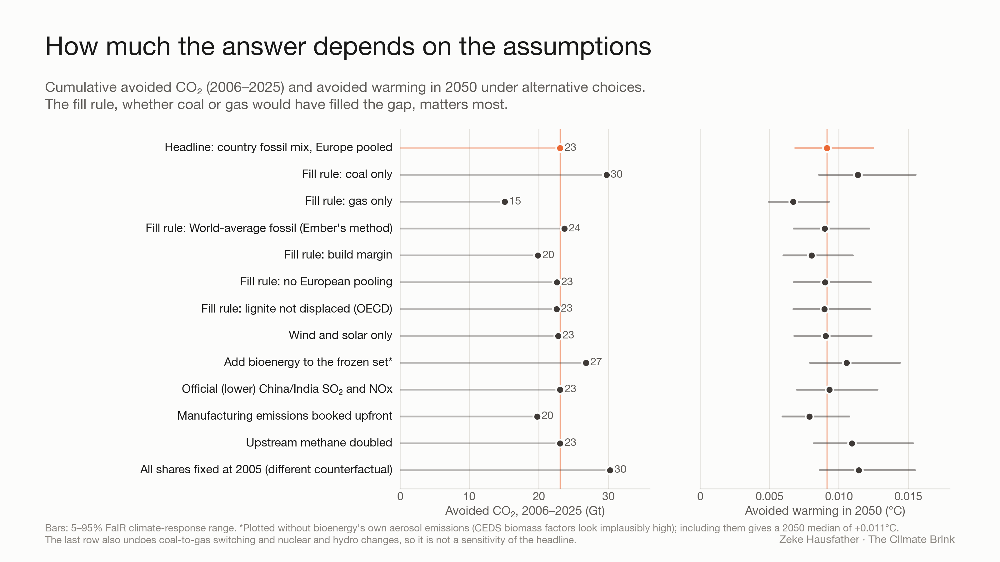
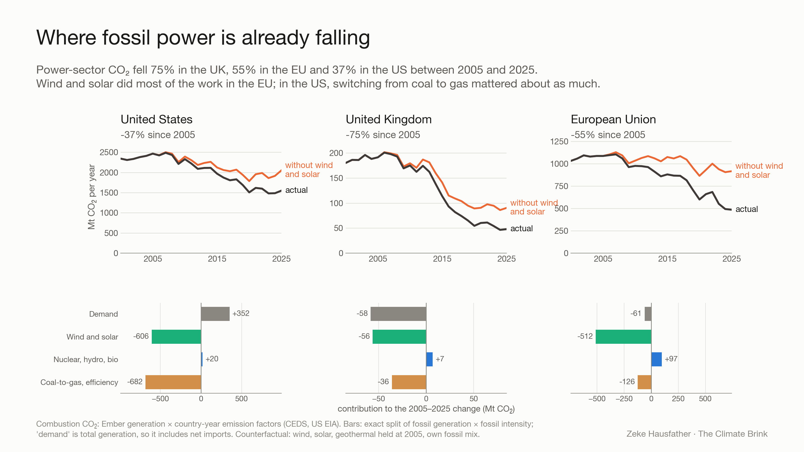

# The world without wind and solar

Code and data for a counterfactual of the global power sector in which wind, solar and geothermal generation stopped growing in 2005. In every country, the missing generation is filled with that country's own fossil fuel mix. The resulting CO2, co-emitted aerosol precursors (SO2, NOx, black and organic carbon) and upstream methane are run through the FaIR climate model. This repository accompanies the Climate Brink post by Zeke Hausfather.

## Headline results

Numbers are as written by the pipeline to `data/headline_numbers.csv`, `data/fair/summary.csv` and `data/regional_decomp.csv`.

| | |
|---|---|
| Power-sector CO2 in 2025, actual vs without wind and solar growth | 13.2 vs 16.9 Gt (**+28%**) |
| CO2 avoided, 2006–2025 | **23 Gt**: 15 Gt if all the gap had been filled by gas, 30 Gt if all by coal |
| CO2 avoided in 2025 alone | 3.7 Gt |
| Net avoided warming in 2025 (all species) | **+0.002 °C** (5–95%: −0.008 to +0.0085); positive in 66% of samples. Aerosol cooling from the extra coal offsets most of the CO2 and methane warming. |
| Avoided warming by 2050 from deployment through 2025 | **+0.009 °C** (0.007 to 0.013) |
| Power-sector CO2 change 2005–2025 | UK −75%, EU −55%, US −37% (without wind and solar growth: −53%, −16%, −17%) |

Temperatures are differences between the counterfactual and the actual world, so no baseline period applies. Full methods, validation, sensitivities and caveats are in **[METHODS.md](METHODS.md)**.






## Reproducing

Requirements: Python 3.11+ (tested on 3.13).

```bash
pip install -r requirements.txt
```

All derived data are committed, so you can start at any step. Scripts read and write relative to the repository and are run from `scripts/`:

```bash
cd scripts
python 00_power_mix.py        # global generation-share charts + 2026 estimate (OWID inputs in data/inputs/owid)
# --- optional: rebuild the extracts from the raw downloads (~125 MB, not committed) ---
curl -o ../ember.csv https://storage.googleapis.com/emb-prod-bkt-publicdata/public-downloads/yearly_full_release_long_format.csv
curl -L -o ../ceds.zip "https://zenodo.org/records/15059443/files/CEDS_v_2025_03_18_detailed.zip?download=1"
python 01_extract_ceds.py ../ceds.zip     # CEDS 1A1a / 1B1 / 1B2 by country, sector, fuel, 2000-2023
python 02_extract_ember.py ../ember.csv   # Ember generation, capacity, demand, emissions subset
# --- analysis ---
python 03_build_fill.py        # renewable gap and fossil fill by country, year and rule
python 04_emission_factors.py  # combustion CO2 and co-emission factors per MWh
python 05_emissions.py         # counterfactual minus actual emissions
python 06_validate.py          # validation checks (incl. reproducing Ember's published 4,065 MtCO2e)
python 07_fair.py              # 28 paired FaIR scenarios, 841-member ensemble (~2 min)
python 08_analyze.py           # numerical checks, emission-factor uncertainty, summary tables
python 09_figures.py           # figures 1-3 and headline numbers
python 10_regional.py          # US / UK / EU decomposition and figure 4
```

Ember revises its yearly release. A fresh download may differ slightly from the copy used here (last modified 2026-06-23); the committed `data/ember_subset_2000_2025.csv` reproduces the published numbers exactly.

## Repository layout

```
scripts/                 pipeline (00-10)
data/                    derived data written by the pipeline
data/fair/               FaIR outputs: member-level ΔT (2000-2050, float32), percentiles, checks, summary
data/inputs/owid/        OWID generation-share and generation datasets (Ember + Energy Institute)
data/inputs/fair_calibration/  fair-calibrate v1.4.5 ensemble, species configs, emissions, forcing
figures/                 figures 1-4 and the global generation-share charts
METHODS.md               methods, parameter choices, validation, sensitivities, caveats
```

## Data sources and licenses

| Data | Source | License |
|---|---|---|
| Electricity generation, capacity, demand by country | [Ember yearly electricity data](https://ember-energy.org/data/yearly-electricity-data/) | CC-BY-4.0 |
| Share of generation by source, generation by source (1985–2025) | [Our World in Data](https://ourworldindata.org/grapher/share-elec-by-source) (Ember; Energy Institute *Statistical Review of World Energy*) | CC-BY-4.0 |
| Emissions by country, sector, fuel | [CEDS v_2025_03_18](https://zenodo.org/records/15059443) (Hoesly et al., JGCRI/PNNL) | CC-BY-4.0 |
| US electric power CO2 and generation | [US EIA Monthly Energy Review](https://www.eia.gov/totalenergy/data/monthly/), tables 11.6 and 7.2b | Public domain |
| China coal-power emission factor and coal consumption rate | MEE 《2023年电力二氧化碳排放因子》; NDRC/NEA 《全国煤电机组改造升级实施方案》 (2021); CEC 《中国电力行业年度发展报告2025》 | Official publications (values only) |
| 2026 growth rates for the share estimate | [IEA Electricity 2026](https://www.iea.org/reports/electricity-2026/supply) | Values only |
| Climate model | [FaIR](https://github.com/OMS-NetZero/FAIR) v2.2.2; fair-calibrate v1.4.5 calibrated, constrained ensemble (Smith et al.) | Apache-2.0 (FaIR); see `data/inputs/fair_calibration/README.md` |

## License

Code: MIT (see [LICENSE](LICENSE)). Data in `data/` and `figures/` are derived from the sources above and remain subject to their licenses; please cite the original sources.
